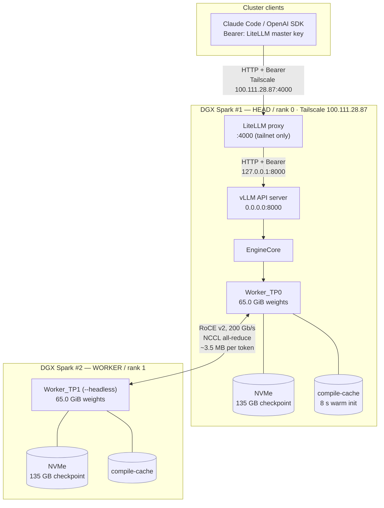
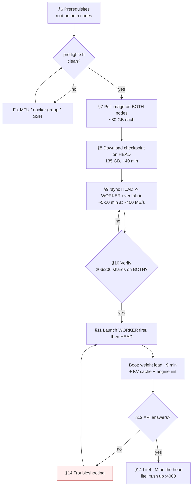
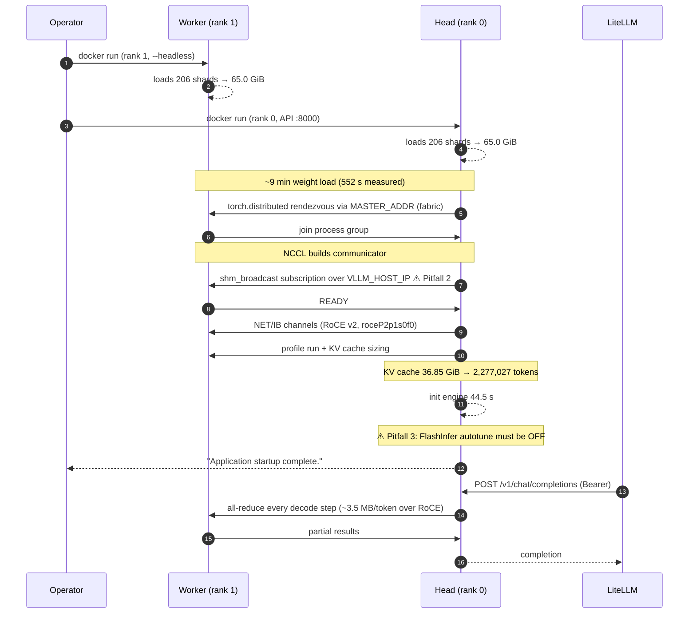
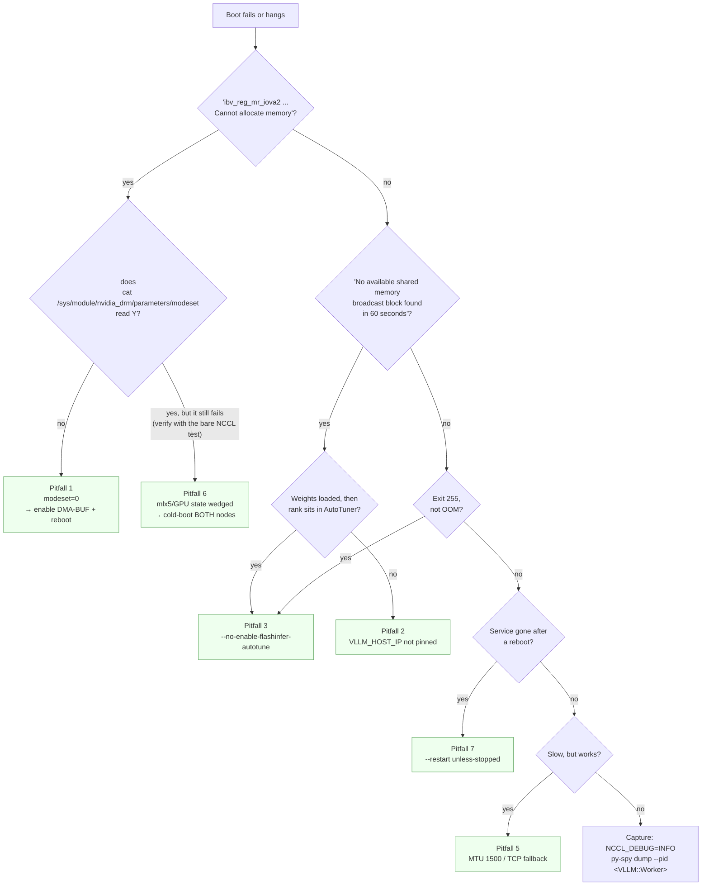
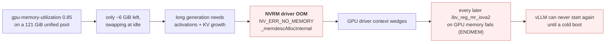
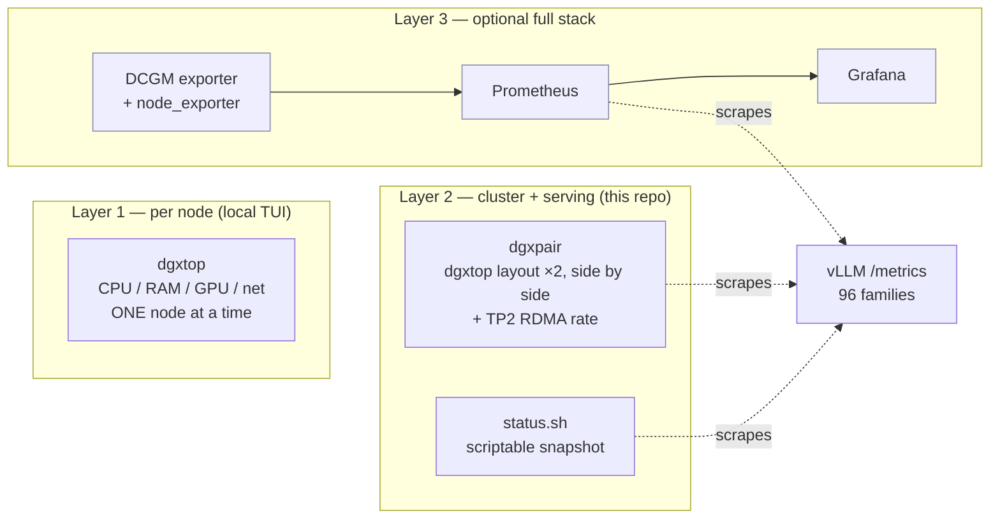

# Runbook — Qwen3.8-Flash-Next-NVFP4 on 2× DGX Spark (GB10) with vLLM TP2

Deploy a 135 GB NVFP4 checkpoint across **two DGX Spark / GB10 nodes** with tensor
parallelism 2, exposed as an OpenAI-compatible API on port **8000** for a remote
LiteLLM to consume.

This runbook is written to be re-runnable on **any** pair of GB10 nodes. Everything
that differs per site is collected in [§2 Variables](#2-variables--confirm-these-first).

**Validated on:** 2026-09-18, head `thinkstationpgx-09bf`, worker `thinkstationpgx-18a7`.
Result: `Application startup complete`, **2,277,027-token KV cache**, 8.69× concurrency at
262,144 tokens, ~38 tok/s single stream.

---

## 1. Architecture



> **Topology note.** LiteLLM runs **on the head node**, alongside vLLM, and is the only
> piece published to the tailnet. vLLM itself stays on `0.0.0.0:8000` but is no longer the
> address clients use. An earlier revision of this runbook assumed an *externally hosted*
> LiteLLM dialing in to `100.111.28.87:8000`; that still works (both ports are reachable)
> but is no longer the documented path. See [§14](#14-litellm-on-the-head-node).

**Why two nodes are mandatory:** the checkpoint is ~130 GiB of weights. One GB10 has
**121 GiB total** unified memory, which must also hold a KV cache. TP2 shards the
weights to ~65 GiB per node, leaving ~37 GiB of KV each.

**Critical detail:** the model's 51 B-parameter **n-gram (PLE) table** must stay
resident. On a *single* Spark that table does not fit and must be mmapped from NVMe
(a different, more invasive recipe). On a **pair** it fits, so no PLE patch is needed —
this is the single biggest reason to deploy on two nodes.

---

## 2. Variables — confirm these first

| Variable | Example value | Notes |
|---|---|---|
| `HEAD_HOST` / `WORKER_HOST` | `192.168.101.10` / `192.168.101.11` | Fabric addresses, same /24 |
| Fabric iface | `enP2p1s0f0np0` | **Verify** — port `f0` vs `f1` differs per unit |
| RoCE device | `roceP2p1s0f0` | Must match the fabric iface |
| `MASTER_ADDR` / `MASTER_PORT` | `192.168.101.10` / `29501` | torch.distributed rendezvous |
| `WORKER_USER` | `nvidia` | Account with passwordless SSH **and docker on the worker** |
| `SSH_KEY` | `~/.ssh/id_ed25519` | Key of the driving account |
| `IMAGE` | `oxbyte/qwen3.8-flash-next-dual-spark:latest` | ~30 GB unpacked |
| `MODEL_REPO` | `RadixArk/Qwen3.8-Flash-Next-NVFP4` | Public, no HF token needed |
| `HOST_PORT` | `8000` | API port |
| `API_KEY` | `sk-vllm-…` | **Rotate between sites** |

Discover the fabric port rather than assuming it:

```bash
ip -4 -o addr show | grep -v ' lo '          # find the iface on the 192.168.101.x net
rdma link                                     # find which RoCE dev is ACTIVE
```

---

## 3. Components and their purpose

| Component | Version / source | Purpose |
|---|---|---|
| **DGX Spark (GB10)** | 2×, SM121, 121 GiB unified each | Compute. 1 GPU per node, no NVLink — the pair is joined only by RoCE |
| **vLLM** | `0.1.dev20073+g8e685d198` (in image) | Inference engine; `--nnodes 2 --distributed-executor-backend mp` shards the model |
| **oxbyte image** | `oxbyte/qwen3.8-flash-next-dual-spark:latest` | `FROM vllm/vllm-openai:qwen38-flash-next` + a patched `ple_layer.py` fixing the FP8-PLE quant gate. Ships `serve.sh` as its entrypoint |
| **Model** | `RadixArk/Qwen3.8-Flash-Next-NVFP4` | 125B-A6B hybrid MoE + 51B n-gram table + 4B MTP. NVFP4 experts, FP8 PLE |
| **NCCL** | 2.29.7 | Cross-node all-reduce over RoCE v2 |
| **RoCE / ConnectX-7** | 2 ports/node, 200 Gb/s | The ONLY fast path between nodes |
| **Docker** | 29.6.2 | One container per node, `--network host` |
| **Tailscale** | tailnet | Publishes LiteLLM to the tailnet; the verified-working path for remote clients |
| **LiteLLM** | `ghcr.io/berriai/litellm:v1.101.0`, on the head | Fronts vLLM on `:4000`; virtual keys, admin UI, spend logging |

### NCCL / vLLM environment that actually works

| Variable | Value | Why |
|---|---|---|
| `NCCL_IB_HCA` | `roceP2p1s0f0` | Pin to the ACTIVE RoCE port. Wrong value → silent TCP fallback |
| `NCCL_SOCKET_IFNAME` | `enP2p1s0f0np0` | Same reason |
| `GLOO_SOCKET_IFNAME` | `enP2p1s0f0np0` | CPU-side collectives |
| `NCCL_IB_ROCE_VERSION_NUM` | `2` | RoCE v2 |
| `NCCL_CUMEM_ENABLE` | `1` | Use the DMA-BUF GPU-memory path (see Pitfall 1) |
| `NCCL_IB_CUDA_SUPPORT` | `1` | Enable GPUDirect when available |
| `NCCL_NVLS_ENABLE` | `0` | No NVLink switch across nodes |
| **`VLLM_HOST_IP`** | **head `.10` / worker `.11`** | **Mandatory** — see Pitfall 2 |

### Container flags (non-negotiable)

```text
--network host --ipc host --privileged --gpus all --shm-size 32g
--device /dev/infiniband --ulimit memlock=-1 --ulimit stack=67108864
```

Without `--device /dev/infiniband` and the memlock ulimit, NCCL silently falls back
to TCP and throughput drops 40–45%.

---

## 4. Model source

| | |
|---|---|
| Repo | https://huggingface.co/RadixArk/Qwen3.8-Flash-Next-NVFP4 |
| Size | **135.2 GB** across **418 files / 206 shards** |
| Architecture | `Qwen4ExpForConditionalGeneration` — hybrid Gated DeltaNet + sparse attention, MoE |
| Quantization | `quant_algo: NVFP4`, group size 16, ModelOpt 0.46.0 |
| Context | 262,144 native, extensible |
| MTP | 4 speculative tokens (draft head included) |
| Per-rank weights | **65.0 GiB** at TP2 |
| Alternative | `nvidia/Qwen3.8-Flash-Next-NVFP4` — the NVIDIA export. Hybrid too, but its MTP experts are block-scaled FP8 under a ModelOpt *mixed-precision* config, which needs an extra vLLM fix (vllm#55513). **RadixArk is the tested path.** |

---

## 5. Deployment workflow



---

## 6. Prerequisites (root, on BOTH nodes)

### 6.1 GPUDirect RDMA must be enabled — see Pitfall 1

```bash
# On BOTH nodes
cat /sys/module/nvidia_drm/parameters/modeset        # MUST be Y
```

If it reads `N`, do [Pitfall 1](#pitfall-1--nvidia-drm-modeset0-kills-gpudirect-rdma) first.
**This is the single most important prerequisite.**

### 6.2 Accounts and groups

Docker access is often split across the pair. The driving account needs docker on the
head; the SSH target needs docker on the worker.

```bash
# On the HEAD
sudo usermod -aG docker "$USER"

# On the WORKER (via ssh; -t so sudo can prompt)
ssh -t <worker-user>@<WORKER_HOST> 'sudo usermod -aG docker <worker-user> && getent group docker'
# must print: docker:x:988:<worker-user>
```

Passwordless SSH from the driving account to the worker:

```bash
ssh-keygen -t ed25519 -N "" -f ~/.ssh/id_ed25519
ssh-copy-id <worker-user>@<WORKER_HOST>
ssh -o BatchMode=yes <worker-user>@<WORKER_HOST> hostname    # must succeed unattended
```

### 6.3 Jumbo frames (performance) — **persisted via netplan**

Both recipes require MTU 9000. This is set in **`/etc/netplan/40-cx7.yaml`**, the file
that defines the two fabric interfaces, so it survives reboot. On this pair it is already
applied; the steps below are for a new site.

Order matters — see [Pitfall 4](#pitfall-4--mtu-change-order-breaks-ssh). Set the
**worker first**, while the head is still at 1500.

**1. Persist it** — add `mtu: 9000` to each ethernet in `40-cx7.yaml` (both nodes):

```yaml
network:
  version: 2
  ethernets:
    enp1s0f0np0:
      addresses:
        - 192.168.100.10/24
      dhcp4: no
      mtu: 9000          # <- add
    enP2p1s0f0np0:
      addresses:
        - 192.168.101.10/24
      dhcp4: no
      mtu: 9000          # <- add
```

**2. Apply it at runtime without bouncing the interface.** `ip link set` is preferred
because it does not renegotiate, so established SSH and NCCL survive:

```bash
# WORKER first, then HEAD
sudo ip link set <fabric-iface>     mtu 9000
sudo ip link set <other-fabric-iface> mtu 9000
```

> ⚠️ **The vLLM container image has no `ip`.** If you are doing this from inside a
> container (as the automation here does), set it through the kernel ioctl instead:
>
> ```bash
> docker run --rm --privileged --network host --entrypoint python3 <IMAGE> -c '
> import socket, fcntl, struct
> SIOCSIFMTU = 0x8922
> for n in (b"enp1s0f0np0", b"enP2p1s0f0np0"):
>     s = socket.socket(socket.AF_INET, socket.SOCK_DGRAM)
>     fcntl.ioctl(s, SIOCSIFMTU, struct.pack("16sI", n, 9000)); s.close()'
> ```

**3. Verify** — no reboot needed. Check all four levels; the third is the one that
actually proves jumbo frames are working:

```bash
# (a) configured MTU
for i in enp1s0f0np0 enP2p1s0f0np0; do echo -n "$i=$(cat /sys/class/net/$i/mtu) "; done
# expect: 9000 9000

# (b) persistence in netplan
./dual-spark/check_mtu.py            # asserts mtu: 9000 and that the YAML parses

# (c) the path actually carries jumbo frames -- MSS on a NEW connection
#     MSS 8948 => path MTU ~8988 (jumbo).  MSS 1448 => still a 1500 path.
ss -tin | grep -A1 <peer-ip> | grep -oE 'mss:[0-9]+'
```

> ⚠️ **Existing connections keep the MSS they negotiated.** Check `ss -tin` right after
> changing the MTU and you will still see ~1448 on your SSH session — that is stale, not
> a failure. You must test a **new** connection. Quick way, from inside a container:
>
> ```bash
> docker run --rm --privileged --network host --entrypoint python3 <IMAGE> -c '
> import socket
> s = socket.socket(); s.connect(("<peer-ip>", 22))
> print("MSS", s.getsockopt(socket.IPPROTO_TCP, socket.TCP_MAXSEG))'
> ```

```bash
# (d) real frames survive the wire -- and no MTU-related errors
dd if=/dev/zero bs=1M count=800 2>/dev/null | ssh <worker> "cat > /dev/null"; echo "exit=$?"
for i in enP2p1s0f0np0; do
  echo "$i rx_err=$(cat /sys/class/net/$i/statistics/rx_errors) tx_err=$(cat /sys/class/net/$i/statistics/tx_errors)"
done
# expect: exit=0 and zero errors
```

> **Do not use `ping -M do -s 8972` here.** ICMP is filtered on this fabric (the same
> filtering that caused Pitfall 2's deadlock), so ping gives a false negative. Use the
> MSS check and a TCP bulk transfer instead.

Measured on this pair: MSS **8948** both directions, 800 MB transferred with `exit=0` and
zero rx/tx errors.

> Do **not** run `netplan apply` while vLLM is serving — it can reconfigure the interface
> and break the NCCL links mid-flight. Set the runtime MTU with `ip link set`, and let the
> next reboot pick the value up from netplan.

### 6.4 Disk

Each node needs **>150 GB free** for the checkpoint, plus ~30 GB for the image.

---

## 7. Pull the image (BOTH nodes)

`docker run` will try to auto-pull a 30 GB image *inline over SSH* and appear to hang.
Pull explicitly on **both** nodes first.

```bash
docker pull oxbyte/qwen3.8-flash-next-dual-spark:latest
ssh <worker-user>@<WORKER_HOST> 'docker pull oxbyte/qwen3.8-flash-next-dual-spark:latest'
```

---

## 8. Download the checkpoint (HEAD only)

The image carries an `hf` CLI, so no host Python is needed. Run as the same user that
will rsync it, so file ownership matches.

```bash
docker run --rm --user "$(id -u):$(id -g)" -e HOME=/tmp -e HF_HOME=/tmp/hf-cache \
  -v "$HOME/models/RadixArk/Qwen3.8-Flash-Next-NVFP4":/model \
  --entrypoint /usr/local/bin/hf \
  oxbyte/qwen3.8-flash-next-dual-spark:latest \
  download RadixArk/Qwen3.8-Flash-Next-NVFP4 --local-dir /model
```

~135 GB, ~40 minutes. Resumable — just re-run.

---

## 9. Sync to the worker

```bash
ssh <worker-user>@<WORKER_HOST> 'mkdir -p ~/models/RadixArk/Qwen3.8-Flash-Next-NVFP4'
rsync -a --info=progress2 --partial --no-compress \
  -e "ssh -o BatchMode=yes" \
  "$HOME/models/RadixArk/Qwen3.8-Flash-Next-NVFP4/" \
  <worker-user>@<WORKER_HOST>:~/models/RadixArk/Qwen3.8-Flash-Next-NVFP4/
```

~400 MB/s measured (SSH-bound, not fabric-bound). Do **not** use NFS: each rank reads
the full checkpoint, and random reads would crawl.

---

## 10. Verify both copies before launching

```bash
# run on each node
python3 - <<'EOF'
import json, os
d = os.path.expanduser("~/models/RadixArk/Qwen3.8-Flash-Next-NVFP4")
m = json.load(open(os.path.join(d, "model.safetensors.index.json")))["weight_map"]
shards = sorted(set(m.values()))
missing = [s for s in shards if not os.path.exists(os.path.join(d, s))]
print(f"shards={len(shards)} missing={len(missing)}")
EOF
```

**Expect `shards=206 missing=0` on both nodes.**

---

## 11. Launch — worker first, then head

```bash
COMMON="--network host --ipc host --privileged --gpus all --shm-size 32g \
        --device /dev/infiniband --ulimit memlock=-1 --ulimit stack=67108864"
ENVS="-e NCCL_IB_HCA=roceP2p1s0f0 -e NCCL_SOCKET_IFNAME=enP2p1s0f0np0 \
      -e GLOO_SOCKET_IFNAME=enP2p1s0f0np0 -e NCCL_IB_ROCE_VERSION_NUM=2 \
      -e NCCL_CUMEM_ENABLE=1 -e NCCL_IB_CUDA_SUPPORT=1 -e NCCL_NVLS_ENABLE=0 \
      -e MASTER_ADDR=192.168.101.10 -e MASTER_PORT=29501 -e WORLD_SIZE=2"
ARGS="--served-model-name qwen38-flash-next-nvfp4 --quantization modelopt_fp4 \
      --tensor-parallel-size 2 --nnodes 2 --distributed-executor-backend mp \
      --enforce-eager --speculative-config {\"method\":\"mtp\",\"num_speculative_tokens\":4} \
      --max-model-len 262144 --max-num-seqs 8 --max-num-batched-tokens 8192 \
      --enable-chunked-prefill --enable-prefix-caching \
      --gpu-memory-utilization 0.85 --tool-call-parser qwen3_coder \
      --enable-auto-tool-choice --reasoning-parser qwen3 --host 0.0.0.0 --port 8000 \
      --no-enable-flashinfer-autotune"
IMG=oxbyte/qwen3.8-flash-next-dual-spark:latest

# 1) WORKER (rank 1, headless) — start FIRST
ssh <worker-user>@<WORKER_HOST> "docker run -d --name qwen38 $COMMON $ENVS \
  -e RANK=1 -e NODE_RANK=1 -e HEADLESS=1 -e VLLM_HOST_IP=192.168.101.11 \
  -v ~/models/RadixArk/Qwen3.8-Flash-Next-NVFP4:/model:ro \
  $IMG /model $ARGS"

# 2) HEAD (rank 0, API) — start SECOND
docker run -d --name qwen38 $COMMON $ENVS \
  -e RANK=0 -e NODE_RANK=0 -e VLLM_HOST_IP=192.168.101.10 \
  -v ~/models/RadixArk/Qwen3.8-Flash-Next-NVFP4:/model:ro \
  $IMG /model $ARGS --api-key sk-vllm-CHANGE-ME
```

> `VLLM_HOST_IP` is **not optional** — see Pitfall 2.
> `--no-enable-flashinfer-autotune` is **not optional** on GB10 — see Pitfall 3.

The `run.sh` / `verify.sh` / `preflight.sh` in this directory automate all of the above;
this section is the manual equivalent.

---

## 12. Sequence diagram — what happens during a boot



### Measured boot timeline

| Phase | Duration |
|---|---|
| Image pull (both nodes) | ~10 min |
| Checkpoint download (head) | ~40 min |
| rsync to worker | ~5–10 min |
| Weight load @TP2 | **552 s** (9.2 min) |
| KV cache + warmup | 44.5 s |
| **Total cold boot to ready** | **~12 min** |

> These are the numbers `deploy/load-test.sh load` compares against. It re-derives
> them from the live container log on every run — see [§20](#20-load-testing--deployload-testsh).

---

## 13. Test URLs and verification

### Endpoints

| URL | Purpose |
|---|---|
| `http://100.111.28.87:8000/v1/models` | **Primary — Tailscale, verified reachable off-box** |
| `http://192.168.101.10:8000/v1` | Fabric — works only from hosts on the 192.168.101.x net |
| `http://<head>:8000/docs` | Interactive OpenAPI docs (needs a client that can send headers) |

> ⚠️ The **WiFi/LAN address must not be used**. Measured from the worker:
> `192.168.33.126:8000` → **TIMEOUT** (that is also what deadlocked boot — Pitfall 2).

### Reachability matrix (measured from another host)

| Address | Result |
|---|---|
| Tailscale | **200 OK** ✅ |
| Fabric (`192.168.101.10`) | 200 OK ✅ |
| WiFi (`192.168.33.126`) | **TIMEOUT** ❌ |

### Health check

```bash
K=sk-vllm-CHANGE-ME
curl -s -H "Authorization: Bearer $K" http://100.111.28.87:8000/v1/models
# expect: {"object":"list","data":[{"id":"qwen38-flash-next-nvfp4", "max_model_len":262144 ...}]}
```

### Functional check

```bash
curl -s -H "Authorization: Bearer $K" -H 'Content-Type: application/json' \
  http://100.111.28.87:8000/v1/chat/completions -d '{
    "model":"qwen38-flash-next-nvfp4",
    "messages":[{"role":"user","content":"What is 17*23? Reply with just the number."}],
    "max_tokens":256, "temperature":0,
    "chat_template_kwargs":{"enable_thinking":false}
  }'
# expect content "\n\n391"
```

### Auth check

```bash
curl -s -o /dev/null -w '%{http_code}\n' http://100.111.28.87:8000/v1/models
# expect: 401  — a bare browser GET always shows {"error":"Unauthorized"}; that is correct
```

> **Reasoning note:** this checkpoint thinks by default. A 400-token request returned
> **all 400 tokens as `reasoning_tokens`**. Send
> `chat_template_kwargs: {"enable_thinking": false}` or the thinking phase can consume
> the entire budget and return empty content.

---

## 14. LiteLLM on the head node

LiteLLM runs as a **compose stack on the head node** — `deploy/litellm/` — and is the
only component published to the tailnet. Clients talk to `:4000`; vLLM on `:8000` is
now an internal detail.

```text
deploy/litellm/
├── compose.yaml      litellm + postgres + redis, all network_mode: host
├── config.yaml       model_list + redis wiring; secrets come from os.environ
├── .env              live secrets, gitignored (see .env.example)
├── .env.example      template
└── litellm.sh        up | down | restart | logs | status | test
```

### 14.1 Bring it up

```bash
cd deploy/litellm
cp .env.example .env && chmod 600 .env     # first time only
$EDITOR .env                                # keys, UI password, VLLM_API_KEY
./litellm.sh up
./litellm.sh test
```

`./litellm.sh up` blocks until `/health/readiness` answers, so a following `test` is safe.

### 14.2 What it exposes, and what it must not

| Endpoint | Bind | Reachable from |
|---|---|---|
| LiteLLM `:4000` | `100.111.28.87` (tailscale0) | **tailnet only** |
| Admin UI `/ui` | same | **tailnet only** |
| Postgres `:5433` | `127.0.0.1` | this host only |
| Redis `:6380` | `127.0.0.1` | this host only |
| vLLM `:8000` | `0.0.0.0` | this host, fabric, tailnet |

`HOST`/`PORT` in `.env` are what pin the proxy to the Tailscale address. **Do not change
`LITELLM_BIND_HOST` to `0.0.0.0`** — that also publishes the proxy on the WiFi interface
(`192.168.33.126`), which §13 documents as the broken path. Verify with:

```bash
ss -tlnp | grep -E ':(4000|5433|6380)'
#  100.111.28.87:4000   <- proxy, tailnet only
#  127.0.0.1:5433       <- postgres, loopback only
#  127.0.0.1:6380       <- redis, loopback only
```

### 14.3 Postgres is mandatory — SQLite will not work

The image ships a **PostgreSQL-only Prisma schema**. Pointing `DATABASE_URL` at a SQLite
file fails schema validation (`the URL must start with the protocol postgresql://`) and
the proxy exits during startup:

```
ERROR:    Application startup failed. Exiting.
```

That is why `compose.yaml` carries a `postgres:16-alpine` sidecar on loopback. It is
tuned small (`shared_buffers=128MB`, `max_connections=50`, `fsync=off`) because vLLM
already holds ~115 GiB on this host. `fsync=off` is a deliberate single-node tradeoff:
a power cut can lose the last seconds of spend logs, not corrupt the database.

### 14.4 Redis — why it is here, and what it actually does

`LITELLM_NUM_WORKERS` is 2, so the proxy runs **two worker processes**. Almost everything
it enforces is state kept per process: rate limits, budgets, deployment cooldowns, cache
invalidation, and the pod lock that elects a single scheduled-job runner. Without Redis
each worker keeps a private copy, so a `100 rpm` virtual-key limit really admits
`100 x 2`, and a revoked key stays usable on the worker that did not see the revocation.

`compose.yaml` therefore runs `redis:7-alpine` on **loopback port 6380** — deliberately
not 6379, so it can never collide with a system Redis — with `--requirepass`. It is tuned
for a host where vLLM already holds ~115 GiB:

| Setting | Value | Why |
|---|---|---|
| `maxmemory` | `256mb` | Without a bound, Redis grows until the OOM killer takes it |
| `maxmemory-policy` | `volatile-lru` | Only keys **with a TTL** are evicted; LiteLLM's rate-limit/budget keys have TTLs, so memory is bounded without silently dropping long-lived state |
| `appendonly` | `yes`, `everysec` | Survives a restart; at most ~1 s of counter loss |
| `bind` | `127.0.0.1` | Never reachable from the tailnet |

**Setting `REDIS_HOST`/`REDIS_PORT` alone does nothing.** The docs are explicit that the
proxy only reads them when `config.yaml` points at Redis, which is why both are wired:

```yaml
router_settings:                # router state: cooldowns, usage/latency routing
  redis_host: os.environ/REDIS_HOST
  redis_port: os.environ/REDIS_PORT
  redis_password: os.environ/REDIS_PASSWORD
litellm_settings:
  cache: true                   # response cache + proxy-wide coordination
  cache_params:
    type: redis
    host: os.environ/REDIS_HOST
    port: os.environ/REDIS_PORT
    password: os.environ/REDIS_PASSWORD
```

Verify coordination is live rather than merely configured — this is the check that
distinguishes the two:

```bash
cd deploy/litellm
PW=$(grep '^REDIS_PASSWORD=' .env | cut -d= -f2)
curl -s -o /dev/null -H "Authorization: Bearer $(grep '^LITELLM_MASTER_KEY=' .env | cut -d= -f2)" \
  -H 'Content-Type: application/json' http://100.111.28.87:4000/v1/chat/completions \
  -d '{"model":"qwen38-flash-next-nvfp4-nothink","messages":[{"role":"user","content":"hi"}],"max_tokens":8}'
docker exec litellm-redis redis-cli -p 6380 -a "$PW" --no-auth-warning --scan --count 50
# expect the rate-limit counters:
#   {api_key:litellm_proxy_master_key}:tokens
#   {model_per_key:...}:tokens
#   {user:...}:tokens
```

An empty Redis after a request means the config is not reaching it. `GET /cache/settings`
(Bearer-authenticated) shows what the proxy actually parsed; it reports `host`/`port` but
**not** `ttl` even when set, so do not use it to confirm caching.

> **Response caching does not work in v1.101.0.** Measured 2026-09-18: an identical
> request issued twice — with an explicit `"cache": {"ttl": 300}`, and again with
> `mode: default_on` — reached vLLM on every call (~0.25–0.30 s each) and wrote no cache
> key to Redis. The coordination path works (the token counters above are real); only
> the response cache is inert. Do not build anything on cache hits here, and re-test if
> the image tag is bumped.

### 14.5 Models

Both aliases hit the same weights; the second disables thinking.

| Alias | Behaviour |
|---|---|
| `qwen38-flash-next-nvfp4` | as-is — the checkpoint **thinks by default** |
| `qwen38-flash-next-nvfp4-nothink` | injects `chat_template_kwargs.enable_thinking=false` |

Use the `-nothink` alias for short or agentic calls: a measured 400-token request returned
**all 400 tokens as `reasoning_tokens`** and no content. Verified through the proxy:

```bash
K=$(grep '^LITELLM_MASTER_KEY=' deploy/litellm/.env | cut -d= -f2)
curl -s -H "Authorization: Bearer $K" -H 'Content-Type: application/json' \
  http://100.111.28.87:4000/v1/chat/completions -d '{
    "model":"qwen38-flash-next-nvfp4-nothink",
    "messages":[{"role":"user","content":"What is 17*23? Reply with just the number."}],
    "max_tokens":64, "temperature":0}' 
# -> content "391", reasoning_tokens 0
```

`additional_drop_params: ["reasoning_effort"]` in `config.yaml` is required: the Qwen3.8
template accepts only `xhigh`/`medium`/`low` and **400s on `high`**, which Claude Code
sends by default.

### 14.6 Clients

Anything OpenAI-compatible points at the proxy with the master key:

```bash
export OPENAI_BASE_URL=http://100.111.28.87:4000
export OPENAI_API_KEY=$(grep '^LITELLM_MASTER_KEY=' deploy/litellm/.env | cut -d= -f2)
```

Admin UI: `http://100.111.28.87:4000/ui` — username `UI_USERNAME`, password `UI_PASSWORD`
from `.env`. Use it to mint per-client virtual keys instead of sharing the master key.

### 14.7 Spend and usage

Every request is written to `LiteLLM_SpendLogs` and is visible via `./litellm.sh status`
or `GET /spend/logs`.

> `spend` is **$0.00 for every call**: this is a local checkpoint with no entry in
> LiteLLM's public price map. Token counts and request counts are accurate; dollar
> figures are not meaningful until you attach per-token pricing to the model. The
> `/spend/logs` endpoint **ignores `start_date`/`end_date`** and returns the whole
> table, and token counts are top-level columns (`total_tokens`), not under `usage`.

### 14.8 Operating notes

- A failed request streams **nothing** until the first token; `timeout`/`stream_timeout`
  are 900 s because a 262k prefill is slow. `max_retries: 0` is deliberate — a retry
  re-runs the whole prefill.
- After editing `config.yaml` or `.env`, run `./litellm.sh restart` (a plain
  `docker restart` will not re-read `env_file`).
- The image's default `CMD` is only `--port 4000`. `compose.yaml` overrides it with
  `--config /app/config.yaml`; without that flag the proxy starts with **zero models**
  and every request 400s with `Invalid model name passed in`.
- Migrations run automatically on boot (`DISABLE_SCHEMA_UPDATE: "false"`); a cold start
  applies 165 migrations before the port opens.


---

## 15. Proving it really runs on both nodes

Three independent checks. Useful for acceptance testing on a new pair.

**a) Per-rank weight shards**

```bash
docker logs qwen38 2>&1 | grep 'Model loading took'                      # head   -> Worker_TP0, 65.0 GiB
ssh <worker> "docker logs qwen38 2>&1 | grep 'Model loading took'"       # worker -> Worker_TP1, 65.0 GiB
```

Two TP ranks on two hosts, 65 GiB each. One GB10 has 121 GiB *total*, so a single node
cannot hold 130 GiB of weights plus KV.

**b) RDMA traffic during a generation** (netdev stats do **not** count RoCE — use the IB counters)

```bash
D=/sys/class/infiniband/roceP2p1s0f0/ports/1/counters
x0=$(cat $D/port_xmit_data); r0=$(cat $D/port_rcv_data)
# ... issue a 500-token completion ...
x1=$(cat $D/port_xmit_data); r1=$(cat $D/port_rcv_data)
echo "xmit $(( (x1-x0)*4/1000000 )) MB  rcv $(( (r1-r0)*4/1000000 )) MB"
```

Measured for 500 tokens: **881.8 MB each way (~3.5 MB per token)**. Zero here means the
model is running on one node.

**c) The headless worker exposes no API**

`<worker>:8000` should time out; only the head serves.

---

## 16. Troubleshooting



### Pitfall 1 — `nvidia-drm modeset=0` kills GPUDirect RDMA

**Symptom**

```
NCCL WARN Call to ibv_reg_mr_iova2 failed with error Cannot allocate memory
RuntimeError: NCCL error: unhandled system error
```

and `modprobe nvidia-peermem` fails with:

```
modprobe: ERROR: could not insert 'nvidia_peermem': Invalid argument
```

**Cause** — a three-layer trap:

1. The legacy GPUDirect path needs `nvidia-peermem`, which needs
   `ib_register_peer_memory_client` — a symbol that exists **only in MLNX_OFED's
   `ib_core`**. These nodes run the inbox Ubuntu `rdma-core`, so the module can
   *never* load. No config change fixes it.
2. The modern path is **DMA-BUF**, which NCCL prefers when `NCCL_CUMEM_ENABLE=1`.
3. DMA-BUF requires `nvidia-drm modeset=1`, and **`/etc/modprobe.d/zz-nvidia-drm-override.conf`
   was setting it to 0** — overriding the driver's own `modeset=1`. NCCL then reported
   `cuMemGdrSupport 0` and fell back to the impossible path.

**Fix** (both nodes, then reboot — `nvidia_drm` is held by the desktop and cannot be unloaded live):

```bash
sudo rm -f /etc/modprobe.d/zz-nvidia-drm-override.conf
sudo update-initramfs -u
sudo reboot
# after reboot:
sudo cat /sys/module/nvidia_drm/parameters/modeset     # must print Y
```

Check the kernel is ready — all three should be set:

```bash
grep -E 'CONFIG_HMM_MIRROR|CONFIG_INFINIBAND_ON_DEMAND_PAGING|CONFIG_DMA_SHARED_BUFFER' /boot/config-$(uname -r)
grep -c ib_umem_dmabuf /proc/kallsyms      # >0 means DMA-BUF RDMA is available
```

> ⚠️ Whoever added that override may have done so for a display/console issue.
> Enabling modeset can bring that back. On a compute node a text console is fine.

### Pitfall 2 — vLLM deadlocks on its inter-node shm broadcast

**Symptom** — boot hangs after the all-reduce backend is chosen:

```
Using ['PYNCCL'] all-reduce backends (for group 'tp:0')
```
…and nothing further. `py-spy dump` shows the two sides of a deadlock:

```
Head   (writer)        wait_until_ready (shm_broadcast.py:626)  self.remote_socket.recv()
Worker (remote reader) wait_until_ready (shm_broadcast.py:637)  recv = self.remote_socket.recv()
```

**Cause** — `shm_broadcast.py` calls `get_ip()` for the address it binds and advertises.
With no override, that resolves to the **default-route interface = WiFi**. The SYN never
completes (ufw on the head and/or WiFi client isolation), so the writer waits forever for
a subscription while the reader waits for `READY`. ZMQ `connect()` never fails, so there
is no error — just silence.

Confirm with:

```bash
ss -tn state syn-sent            # on the worker — shows a stuck SYN to the head's WiFi IP
```

**Fix** — pin the fabric IP on **both** nodes:

```bash
-e VLLM_HOST_IP=192.168.101.10     # head
-e VLLM_HOST_IP=192.168.101.11     # worker
```

`VLLM_HOST_IP` feeds `vllm/utils/network_utils.py:get_ip()`, which is exactly what
`shm_broadcast.py:524-534` binds.

> NCCL was never affected because it follows `MASTER_ADDR` (the fabric). That is why a
> bare two-node all-reduce passed while vLLM hung — do not be misled by it.

### Pitfall 3 — FlashInfer autotune hangs the boot

**Symptom** — weights load fully (`Model loading took 65.0 GiB`), then one rank sits in:

```
[AutoTuner]: Tuning trtllm::fused_moe::gemm2
```

while the other logs the shm-broadcast timeout every 60 s for ~20 minutes, then both
containers die with **exit 255 and `OOMKilled=false`**.

**Fix** — append to the vLLM args (both nodes):

```bash
--no-enable-flashinfer-autotune
```

Verify it reached the process:

```bash
p=$(docker inspect -f '{{.State.Pid}}' qwen38)
tr '\0' ' ' < /proc/$p/cmdline | tr ' ' '\n' | grep flashinfer
```

### Pitfall 4 — MTU change order breaks SSH

On a direct-attached fabric with **ICMP filtered**, raising the head to MTU 9000 while the
worker is still 1500 black-holes new connections — the sender emits frames the receiver's
NIC drops, and PMTU discovery cannot correct it.

**Always set the WORKER first**, then the head. The mismatch only hurts when the
*sender's* MTU exceeds the *receiver's*.

### Pitfall 5 — slow, but working

| Symptom | Check | Fix |
|---|---|---|
| Low throughput | `rdma link` shows port DOWN | Use the ACTIVE port in `NCCL_IB_HCA` |
| ~40% slower | NCCL fell back to TCP | Ensure `--device /dev/infiniband` + `--ulimit memlock=-1` |
| Marginal | MTU still 1500 | [§6.3](#63-jumbo-frames-performance) |
| `NCCL_IB_HCA` wrong | `NCCL_DEBUG=INFO` shows `NET/Socket` | Should show `NET/IB : Using [0]roceP2p1s0f0:1/RoCE` |

### Pitfall 6 — RDMA registration wedges; only a cold boot clears it

> **Most common trigger: a memory-exhaustion OOM that wedges the GPU driver.** See the
> causal chain below. If `gpu-memory-utilization` is above 0.80 on GB10, fix that first —
> otherwise this will keep coming back after every reboot.

**Symptom** — the pair has been running (or has had containers force-killed), then a
restart fails with the *same* message as Pitfall 1, even though `modeset` is `Y`:

```
misc/ibvwrap.cc:213 (wrap_ibv_reg_mr_iova2) NCCL WARN
Call to ibv_reg_mr_iova2 failed with error Cannot allocate memory

RuntimeError: NCCL error: unhandled system error
```

Inside vLLM this presents as a **hang**, not an error, because only one rank raises:
rank 0 blocks in `ncclAllReduce` during `PyNcclCommunicator.__init__` while rank 1 is
still in the gloo unique-id `broadcast` that precedes it. `py-spy` shows exactly that
split. The failure is in the **mlx5/GPU** memory-registration path, not in vLLM.

#### The full causal chain (observed 2026-09-22)

This is what a long generation on an over-committed box actually does:



Kernel evidence — this is in `dmesg`, not the container log, so it survives a crash:

```
[06:56:07] NVRM: nvCheckOkFailedNoLog: Check failed: Out of memory [NV_ERR_NO_MEMORY]
           (0x00000051) returned from _memdescAllocInternal(pMemDesc) @ mem_desc.c:1359
[06:56:13] NVRM: (same)
```

Read it on a running system — `dmesg` needs CAP_SYSLOG, so go through a container:

```bash
docker run --rm --privileged --entrypoint sh <IMAGE> -c \
  'dmesg -T | grep -iE "NVRM|Out of memory|throttl" | tail -20'
```

> **It is NOT overheating.** The same investigation showed **0 thermal throttle events**,
> both GPUs at **42 °C**, and `clocks_throttle_reasons.active = 0x0`. If you suspect heat,
> check `dmesg` for `throttl` — on this box the answer was memory, every time.

#### Why it gets worse: the crash loop

With `--restart unless-stopped`, a wedged driver turns one failure into an unbounded
restart loop — `restarts=29` was observed, each attempt re-registering MRs against an
already-broken driver. **Break the loop before doing anything else:**

```bash
docker update --restart=no qwen38-flash-next-nvfp4-vllm && docker stop qwen38-flash-next-nvfp4-vllm
# both nodes
```

Then confirm the wedge with the bare test below. Memory will look fine (119 GiB free) —
that is expected and is why this is easy to misdiagnose as a memory problem when it is
now a *driver* problem.

**Confirm it is this, not vLLM** — run the minimal test outside vLLM, from a state with
no vLLM containers and no GPU processes:

```bash
# both nodes, fresh containers, same NCCL env; a 64 MB all-reduce
docker run -d --name nccl-clean <COMMON flags> <NCCL env> -e RANK=1 ... /t.py
```

If that all-reduce fails with `ibv_reg_mr_iova2 … Cannot allocate memory`, the driver
state is wedged and no amount of vLLM restarting will help.

**Fix** — reboot the node(s), then re-run the same test; it should print
`value=3.0 expect=3.0 OK` on both ranks. Observed 2026-09-18: after a head reboot the
worker was left with a wedged container holding 114 GiB and `TCPStore … Broken pipe`
errors; *both* nodes then failed registration until **both** were cold-booted. Note the
worker had been up 4h16m and had never rebooted — rebooting only the head was not enough.

**Then prevent the recurrence** — this is the actual fix, and a reboot alone is not
enough:

```bash
# deploy/dual-spark/dual.env
GPU_MEMORY_UTILIZATION=0.75      # was 0.85 (upstream default) -- too aggressive here
```

0.75 leaves ~30 GiB free per node after weights+KV, enough for a long generation's
activation peak plus MTP drafting. Cost: the KV pool drops from ~2.3M to ~1.6M tokens —
still ~6x concurrency at 262k context. Raise it only with `MemAvailable` monitored under
real load; treat **`MemAvailable < 10 GiB`** as the danger line.

> ⚠️ Do **not** run extra NCCL/gloo tests inside a container that is already hung. Those
> tests add GPU/RDMA contexts on top of a bad state and make it worse. Stop the
> containers first, then test in fresh ones.

> ⚠️ `run.sh up` does `docker rm -f`, which **destroys the container log**. If you need
> the vLLM-side evidence after a hang, read it *before* restarting — or rely on `dmesg`,
> which survives and carries the decisive NVRM line anyway.

### Pitfall 7 — a reboot leaves the pair half-up

The container must carry `--restart unless-stopped`. Without it a reboot stops vLLM and
it never returns, while the other node stays up holding ~114 GiB and logging:

```
[rank1] Failed to check the "should dump" flag on TCPStore,
        (maybe TCPStore server has shut down too early), with error: Broken pipe
```

`run.sh` sets this now. To retrofit a running container without recreating it:

```bash
docker update --restart unless-stopped qwen38-flash-next-nvfp4-vllm   # both nodes
```

Verify after any reboot:

```bash
docker inspect -f '{{.HostConfig.RestartPolicy.Name}}' qwen38-flash-next-nvfp4-vllm
# expect: unless-stopped
```

Note the **worker must come up before the head**. With auto-restart on independent
machines the order is not guaranteed, but rank 0 waits for rank 1 at the TCPStore
(torch's default rendezvous timeout, ~30 min), so a late worker normally still joins.

### Debugging toolkit

```bash
# Verbose NCCL
-e NCCL_DEBUG=INFO

# Python stack dump of a hung container (py-spy is not in the image)
docker cp dump_stacks.sh qwen38:/tmp/ && docker exec qwen38 sh /tmp/dump_stacks.sh

# Where is it blocked?
ss -tn state syn-sent
rdma link
```

---

## 17. Operations

### After a reboot — the recovery procedure

Normally you run **nothing**. Both containers carry `--restart unless-stopped`, so Docker
brings them back on boot by itself. Weight loading takes ~9-12 minutes (longer if the page
cache is cold), so allow ~15 minutes before concluding anything is wrong.

> ⚠️ **But "containers are up" does NOT mean the service is up.** Observed 2026-09-22: both
> containers auto-started correctly (`restarts=0`, `unless-stopped` intact) and then
> **wedged in the torch rendezvous** — both ranks blocked inside the `TCPStore()`
> constructor (`_create_c10d_store`, `rendezvous.py:199`), connections established, memory
> stuck at ~9 GB instead of ~79 GB. No error, no progress, indefinitely. `./run.sh up`
> cleared it immediately. Always verify the **API**, not just `docker ps`.

```bash
# 1. wait ~15 min, then check the API (not just the containers)
cd /home/aipc/Documents/vLLM/deploy
./status.sh
curl -s -H "Authorization: Bearer $API_KEY" http://127.0.0.1:8000/v1/models
```

Diagnosing a wedged boot — resident memory is the fastest discriminator:

```bash
free -g | head -2                    # ~79 GB => loading normally
ssh <worker> 'free -g | head -2'     # ~9 GB after 5+ minutes => wedged
docker logs --tail 3 qwen38-flash-next-nvfp4-vllm
# silent, or repeating the same world_size= line => wedged
```

**If the API is not up, start them manually:**

```bash
cd /home/aipc/Documents/vLLM/deploy/dual-spark
./run.sh up
```

That is the whole command. It stops any half-up container and launches the **worker
first, then the head**, with the fabric/NCCL env, `VLLM_HOST_IP`, and
`--restart unless-stopped`. Run it as the account that has docker on the head (`aipc`);
it reaches the worker as `nvidia@192.168.101.11`.

> ⚠️ **`run.sh up` destroys and recreates both containers** (`docker rm -f` then
> `docker run`), so it always costs a full ~12-minute weight reload. **Do not run it while
> the weights are loading** — check `free -g` first (~79 GB/rank means it is progressing).
> Running it mid-load turns a healthy boot into a 12-minute outage.

#### Decision table

| Symptom after reboot | Action |
|---|---|
| Both containers `Up`, `/v1/models` returns 200 | Nothing. Done. |
| Containers up, memory climbing toward ~79 GB/rank | Nothing. Still loading (~15 min total). |
| Containers up, memory stuck ~9 GB, logs silent or repeating `world_size=` | **Wedged rendezvous** → `./run.sh up` |
| **Neither** container exists / both `Exited` | `./run.sh up` |
| **One** container up, the other gone | `./run.sh up` (recreates both cleanly) |
| Both up but `ibv_reg_mr_iova2 … Cannot allocate memory` | Not a restart problem — see [Pitfall 6](#pitfall-6--rdma-registration-wedges-only-a-cold-boot-clears-it): cold-boot **both** nodes |
| Head up, worker wedged holding ~114 GiB with `TCPStore … Broken pipe` | `./run.sh up` |

#### Why the order matters

Rank 1 (worker) must be reachable before rank 0 (head) finishes its rendezvous. With
auto-restart on two independent machines the order is not guaranteed — but rank 0 waits
for rank 1 at the TCPStore (torch's default ~30 min rendezvous timeout), so a late worker
normally still joins. If the head does give up, `./run.sh up` re-runs both.

### Routine commands

```bash
# Logs
docker logs -f qwen38
ssh <worker> 'docker logs -f qwen38'

# Restart (order: worker first, then head)
ssh <worker> 'docker restart qwen38'; sleep 5; docker restart qwen38

# Stop
ssh <worker> 'docker rm -f qwen38'; docker rm -f qwen38
```

### LiteLLM proxy (§14)

The proxy is independent of the vLLM container: it survives a vLLM restart and simply
returns upstream errors until vLLM is back. It is `restart: unless-stopped`, so it also
comes back after a reboot — earlier than vLLM, which needs ~12 minutes of weight loading.

```bash
cd deploy/litellm
./litellm.sh status            # reachability, upstream, models, spend
./litellm.sh logs              # follow
./litellm.sh restart           # after editing config.yaml or .env
./litellm.sh down              # keeps the litellm-pgdata and litellm-redisdata volumes
```

```bash
# Logs
docker logs -f litellm-proxy
docker logs -f litellm-postgres
docker logs -f litellm-redis

# Flush Redis state (drops rate-limit counters and cooldowns; harmless, they rebuild)
PW=$(grep '^REDIS_PASSWORD=' .env | cut -d= -f2)
docker exec litellm-redis redis-cli -p 6380 -a "$PW" --no-auth-warning info memory | grep used_memory_human
```

After a reboot, verify all three of these — the first two persist by design, MTU now does
too (it is in netplan, §6.3):

```bash
docker inspect -f '{{.HostConfig.RestartPolicy.Name}}' qwen38-flash-next-nvfp4-vllm   # unless-stopped
sudo cat /sys/module/nvidia_drm/parameters/modeset                                    # Y
for i in enp1s0f0np0 enP2p1s0f0np0; do echo -n "$i=$(cat /sys/class/net/$i/mtu) "; done  # 9000 9000
```

A full restart costs **~12 minutes** of weight loading. `COMPILE_CACHE` bind-mounts cut
~80 s of engine init on subsequent boots.

---

## 18. Acceptance checklist for a new pair

- [ ] `rdma link` — correct port ACTIVE on both nodes
- [ ] `cat /sys/module/nvidia_drm/parameters/modeset` → `Y` on both
- [ ] `grep -c ib_umem_dmabuf /proc/kallsyms` → `> 0`
- [ ] Passwordless SSH works unattended
- [ ] docker usable on the head **and** on the worker
- [ ] MTU 9000 on both (worker first) — **persisted in `/etc/netplan/40-cx7.yaml`**, verify with `dual-spark/check_mtu.py`
- [ ] Image present on **both** nodes
- [ ] `shards=206 missing=0` on **both** nodes
- [ ] `VLLM_HOST_IP` pinned to the fabric on both
- [ ] `--no-enable-flashinfer-autotune` present in the running process
- [ ] `NCCL_DEBUG=INFO` shows `NET/IB … RoCE`, not `NET/Socket`
- [ ] `/v1/models` → 200 with key, 401 without
- [ ] A completion returns correct output
- [ ] RDMA counters move ~3.5 MB/token during generation (proves TP2)
- [ ] LiteLLM `api_base` uses **loopback** (`127.0.0.1:8000`), since it runs on the head
- [ ] `docker inspect -f '{{.HostConfig.RestartPolicy.Name}}' qwen38-flash-next-nvfp4-vllm` → `unless-stopped` on **both** nodes (Pitfall 7)
- [ ] The bare 2-node NCCL test passes *before* launching vLLM — `value=3.0 expect=3.0 OK` on both ranks (Pitfall 6)
- [ ] `ss -tlnp` shows LiteLLM on `100.111.28.87:4000` **only**, Postgres on `127.0.0.1:5433`, Redis on `127.0.0.1:6380`
- [ ] A request leaves the rate-limit token counters in Redis (§14.4) — proves coordination, not just configuration
- [ ] `./litellm/litellm.sh test` passes end-to-end, including a completion
- [ ] A request through `:4000` appears in `/spend/logs` and `./litellm.sh status`

---

## 19. Monitoring

There is no single upstream dashboard that spans a Spark *pair* — `dgxtop` and every
DGX-native tool is per-node. The practical setup is three layers.



### Layer 1 — `dgxtop` (already installed)

Per-node hardware TUI. It takes **no host argument** (`--interval`, `--theme`,
`--no-gpu`, `--net-max` only), so watch the pair with two terminals:

```bash
dgxtop                                  # head, locally
ssh nvidia@192.168.101.11 'dgxtop'      # worker, over the fabric
```

Both work fine, since SSH already runs over the fabric. Use it for thermal, power and
per-core detail. It will not show you serving state or which node is doing what.

> On GB10 `nvidia-smi` reports GPU memory as `[N/A]` (unified memory), so GPU memory
> figures are unreliable on these boxes — use host `free -m` instead.

### Layer 2 — `dgxpair` (live TUI)

Reproduces [dgxtop](https://github.com/DennySORA/dgxtop)'s layout and visual language,
rendered for **both nodes side by side**. dgxtop itself is single-node and has no remote
capability anywhere in its collectors, so this is a reimplementation of its look — rounded
borders, the cyan-on-`header_bg` chrome, threshold gradient gauges (green → yellow at 70%
→ red at 90%) with half-block sub-cell precision, sparklines — not a fork of its Rust.

```bash
./dgxpair              # live, 2 s refresh (Ctrl-C to quit)
./dgxpair -i 1         # faster refresh
./dgxpair --once       # single snapshot
./dgxpair --no-color   # plain output, pipe-friendly
```

Needs **120+ columns** for the side-by-side view; below that it stacks the nodes
automatically. Under load (captured at 170 columns):

```
  DGXPAIR │  1 Overview  2 Nodes            HEAD thinkstationpgx-09bf  WORKER thinkstationpgx-18a7  14:40
╭─ CPU (20 cores) ──────────────────────────╮ ╭─ CPU (20 cores) ──────────────────────────╮
│ load 1.82  ·  20 cores  ·  up 3h9m        │ │ load 0.34  ·  20 cores  ·  up 3h6m        │
│ ██████████▌░░░░░░░░░░░░░░░░░░░░░░  15.2%  │ │ ███████▎░░░░░░░░░░░░░░░░░░░░░░░░  10.4%  │
│  0▏░░░░░░░░  1▎░░░░░░░░  2▏░░░░░░░░       │ │  0░░░░░░░░░  1░░░░░░░░░  2░░░░░░░░░       │
│ 15███████▋░ 16████████▉ 17░░░░░░░░░       │ │  6▎░░░░░░░░  7▋░░░░░░░░  8████████▉       │
│ avg ▁█                                    │ │ avg █▁                                    │
╰───────────────────────────────────────────╯ ╰───────────────────────────────────────────╯
╭─ MEM ─────────────────────────────────────╮ ╭─ MEM ─────────────────────────────────────╮
│ RAM ███████████████████████████████▊░░ 96%│ │ RAM ██████████████████████████████▍░░ 94%│
│ SWP ███████████████████▍░░░░░░░░░░░░░ 34% │ │ SWP ██████████░░░░░░░░░░░░░░░░░░░░░ 17% │
╰───────────────────────────────────────────╯ ╰───────────────────────────────────────────╯
╭─ GPU ─────────────────────────────────────╮ ╭─ GPU ─────────────────────────────────────╮
│ [0] NVIDIA GB10                           │ │ [0] NVIDIA GB10                           │
│ ██████████████████████████████████▌░░ 94% │ │ █████████████████████████████████▉░ 93% │
│ 36.51W   sm 2528MHz                       │ │ 35.76W   sm 2522MHz                       │
╰───────────────────────────────────────────╯ ╰───────────────────────────────────────────╯

╭─ PAIR · SERVING ────────────────────────────────────────────────────────────────────────╮
│ ● UP  qwen38-flash-next-nvfp4   running 2  waiting 0  preempt 0       27 tok/s           │
│ KV ░░░░░░░░░░░░░░░░░░░░   0.0%      PREFIX  12.8% hit                                   │
│ TP2 roceP2p1s0f0  ▌░░░░░░░░░░░░░░░░░░░░░░░   553.6 MB/s  linked                         │
╰─────────────────────────────────────────────────────────────────────────────────────────╯
```

Read it as three signals:

- **Both GPUs near 94%** with matching power/temperature — one node alone would show a
  single busy GPU.
- **`running 2`** concurrent requests served by the pair.
- **`TP2 … linked`** — the RDMA link carrying tensor-parallel all-reduce. `idle` here
  while requests are in flight means the model is no longer spanning both nodes.

The gauge is scaled against the 200 Gb/s link (25 GB/s), so a single stream sitting at
~0.3 GB/s correctly shows a nearly empty bar — it is a share-of-link reading, not a
share-of-observed-max.

It reaches the worker over a multiplexed SSH connection (`ControlPersist`), so repeat
polls cost ~10 ms rather than a fresh handshake, and it degrades gracefully: if the
worker is unreachable that column reads `unreachable` while the rest keeps updating.

### Layer 2b — `status.sh` (scriptable)

One screen for the whole deployment: serving health, live throughput, KV-cache
utilisation, prefix-cache hit rate, **RDMA MB/s** (which is what actually proves both
nodes are working), and both nodes' container/memory/uptime side by side.

```bash
./status.sh              # one-shot snapshot
./status.sh watch 2      # live, 2 s refresh
```

```
 SERVICE   ● UP     model=qwen38-flash-next-nvfp4
 TRAFFIC   running=1   waiting=0     preemptions=0
 KV CACHE    0.0%  ░░░░░░░░░░░░░░░░░░░░░░░░░
 PREFIX    hit rate   0.0%  (0/262)
 RATES     prompt        0 tok/s   generation       38 tok/s
 FABRIC       255.3 MB/s over roceP2p1s0f0
──────────────────────────────────────────────────────────────────────
 HEAD      rank0  running   115/121 GiB used       up 1 hour, 5 minutes
 WORKER    rank1  running   111/121 GiB used       up 1 hour, 2 minutes
```

Zero dependencies — bash, curl and python3, all already present. `FABRIC` is the one
number to watch: it should be in the hundreds of MB/s during generation, and **0 means
the model is no longer running across both nodes**.

### Layer 2c — LiteLLM proxy

`./litellm/litellm.sh status` covers the proxy tier in one screen: readiness, whether a
key is enforced, upstream vLLM health, the served aliases, and accumulated requests and
tokens per alias. For a scrapeable view, LiteLLM exposes Prometheus metrics at
`GET /metrics` on `:4000` (Bearer-authenticated), so the Layer 3 stack below can collect
it alongside vLLM without a second exporter.

```bash
curl -s http://100.111.28.87:4000/health/readiness   # {"status":"healthy","db":"connected"}
```

> `/health/readiness` reports only `status` and `db` — it does **not** report Redis, so a
> green readiness check does not prove coordination is wired. Use the token-counter check
> in §14.4, or `redis-cli info memory`, for that.

### Layer 3 — Prometheus + Grafana (optional, production)

Only worth it if you want history, alerting and long-term graphs. vLLM already exposes
**96 metric families** at `GET /metrics` (Bearer-authenticated), including:

| Metric | Meaning |
|---|---|
| `vllm:num_requests_running` / `_waiting` | queue depth — the first thing to watch under load |
| `vllm:kv_cache_usage_perc` | KV pressure; near 100% ⇒ preemption |
| `vllm:num_preemptions_total` | requests evicted — should stay 0 |
| `vllm:prefix_cache_hits_total` / `_queries_total` | prefix-cache effectiveness |
| `vllm:generation_tokens_total` / `prompt_tokens_total` | throughput counters |
| `vllm:e2e_request_latency_seconds`, `time_to_first_token_seconds` | latency histograms |
| `vllm:iteration_tokens_total` | step size — tracks MTP acceptance |

To stand it up (needs root, ~GB of install):

1. **GPU metrics** — `dcgm-exporter` (NVIDIA/dcgm-exporter) on **both** nodes, since
   each has its own GB10.
2. **Node metrics** — `node_exporter` on both.
3. **vLLM metrics** — scraped from the head at `:8000/metrics` with the Bearer token
   (`authorization` + `bearer_token` in the Prometheus scrape config).
4. **Grafana** — vLLM publishes an official dashboard; import it and add a panel over
   `rate(vllm:generation_tokens_total[1m])`, plus an RDMA panel from
   `roceP2p1s0f0/ports/1/counters/port_xmit_data` via node_exporter's
   `node_infiniband_port_data_transmitted_bytes_total`.

> ⚠️ Because `gpu-memory-utilization` is 0.85 on a **unified-memory** box, the metric
> that predicts trouble is host **`MemAvailable`**, not GPU memory. Set the alert on
> `MemAvailable < 10 GiB`; below that the box starts swapping and generation collapses.

---

## 20. Load testing — `deploy/load-test.sh`

One entrypoint for the two questions a local model actually gets asked: **how long
does it take to load**, and **how much traffic can it serve**. It reads the same
`dual-spark/dual.env` as `run.sh` / `verify.sh` / `status.sh`.

### 20.1 How to Run

Paths resolve from the script rather than the cwd, so every command below works from
anywhere in the repo.

> **Before you run anything.** Nothing in the tool stops, restarts or re-creates a
> container, and nothing writes `drop_caches`. On a GB10 holding 65 GiB of live
> weights in unified memory, a cache drop is not a neutral act — it is the difference
> between "the model is slow to answer" and "the GPU context OOMs" (see the
> `GPU_MEMORY_UTILIZATION` note in `dual.env`). `load` measures the boot **already in
> the log**; a genuinely cold number requires the restart, which `load --cmd` prints
> for you to run. `bench`, though, **does** put traffic on the box — and this pair
> also serves LiteLLM / Claude Code traffic, so look at `deploy/status.sh`
> first. `bench` refuses to start while requests are in flight; `--force` overrides.

**Start here.**

| command | cost | what it gives you |
|---|---|---|
| `deploy/load-test.sh check` | ~40 s, read-only | both ranks, API + model id, auth 401, idle, `MemAvailable`, swap, checkpoints and compile caches on **both** nodes, log retention |
| `deploy/load-test.sh load --pair` | ~1 min, read-only | boot timeline for rank 0 **and** rank 1, each phase against the §12 baseline |
| `deploy/load-test.sh bench` | ~1 min, live traffic | 48 requests over a 1 → 2 → 4 → 8 ladder |

```bash
deploy/load-test.sh check          # ~40 s. Read-only. Safe any time
deploy/load-test.sh load --pair    # ~1 min. Read-only. Both ranks
deploy/load-test.sh bench          # ~1 min. Puts load on the box; refuses if it is busy
```

Exit codes are meaningful — `0` ok, `1` on a FAIL or a breached `--budget` — so a
full sweep composes:

```bash
deploy/load-test.sh check && deploy/load-test.sh load --pair --budget 900 && deploy/load-test.sh all
```

**Bench shapes** — flags after `bench` pass straight through (`bench --help` lists them):

```bash
deploy/load-test.sh bench --levels 1,2,4,8 --max-tokens 128        # default
deploy/load-test.sh bench --levels 1,4,8,16                        # past MAX_NUM_SEQS=8: queueing is the point
deploy/load-test.sh bench --input-tokens 8000 --max-tokens 512     # long-context prefill pressure
deploy/load-test.sh bench --duration 60                            # sustained: 60 s per level, not N requests
deploy/load-test.sh bench --levels 4 --requests 40 --ignore-eos    # steady-state decode, no early stops
deploy/load-test.sh bench --no-cache-bust --levels 1,8             # measure the prefix cache instead of beating it
LEVELS=1,2,4 deploy/load-test.sh bench                             # ladder from the environment
```

**For a genuinely cold load number**, in this order — the tool deliberately will not
do the restart for you:

```bash
deploy/load-test.sh load --cmd                    # prints the procedure, changes nothing
cd deploy/dual-spark && ./run.sh up               # yours to run: drops caches, worker then head (~12 min)
cd ../.. && deploy/load-test.sh load --watch --pair   # follow it live, read-only
```

`--watch` prints milestones as they land and raises the pitfall signatures (§16) only
once they cross the threshold where they stop being normal: one `No available shared
memory broadcast block` line during a 9-minute weight load is expected, ten is the
Pitfall 2 deadlock.

**Remarks.**

* `--pair`, and the worker rows of `check`, need ssh to `$WORKER`; when it is
  unreachable they degrade to `WARN` / a rank-0-only report, never a false `FAIL`.
* `check` reports `WARN` for swap in use and for a thin compile cache — both are
  load-time problems in waiting, but neither blocks a test.
* Every bench run writes JSON (all counters, per-request percentiles, error samples)
  to `deploy/loadtest/results/<UTC>-bench.json`; `--no-json` opts out, `--json PATH`
  relocates.
* `load --json PATH` writes the machine-readable phase table for a boot.

| subcommand | meaning |
|---|---|
| `check` (default) | preflight table |
| `load [--pair] [--budget N] [--json P]` | boot timeline from the retained log |
| `load --watch [--stall N]` | live milestone feed from `docker logs -f` |
| `load --cmd` | print the cold-restart procedure; execute nothing |
| `bench <bench.py flags>` | traffic ladder; `bench --help` for the full set |
| `all` | check → load --pair → bench |

### 20.2 `load` — where the boot time went

Measured 2026-09-23 against the container that has been up since 2026-09-22 07:34 UTC:

| Phase | rank 0 (head, API) | rank 1 (worker, headless) |
|---|---|---|
| container start → loader starts | 43 s | 43 s |
| weights loaded (65.0 GiB/rank) | **560.2 s** (476.8 main + 62.1 MTP draft) | 445.4 s (376.1 + 47.8) |
| effective NVMe read rate | 0.116 GiB/s | 0.146 GiB/s |
| KV cache sized | 25.49 GiB → 1,473,862 tokens | 22.52 GiB |
| profile + KV + warmup (`init engine`) | **79.0 s** | — |
| HTTP listening → `startup complete` | +66 s | — |
| **total to ready** | **748 s (12.5 min)** | 672 s (its own work) |

Three things that table is for:

* **Weight load is a disk-rate problem, not a GPU problem.** 0.116 GiB/s × 560 s
  is the whole 65 GiB. If a boot is slow, read the rate first: a cold compile cache
  or a contended NVMe shows up there, not in `init engine`.
* **Rank 0 is the slow rank, by ~115 s**, because it also runs the API process and
  the tokenizer. `--pair` prints both and reports the pair as the *slower* rank —
  rank 0's number alone flatters a TP2 boot.
* **`init engine` is 79 s against the 44.5 s baseline (§12).** The tool flags the
  delta rather than hiding it; treat it as the number to beat, and suspect a cold
  `/compile-cache` before the model.

Pitfall signatures (2, 3, 6, §17) are matched in the same pass, each with a hit
count threshold — a single `No available shared memory broadcast block` line during
a 9-minute weight load is **normal** (the queue has no reader yet); Pitfall 2 was
pathological at ~20 minutes of them, once per minute.

### 20.3 `bench` — what the pair can serve

Closed-loop ladder, streaming, ~128 prompt tokens in / 128 out, **cache-busted
prompts** (prefix caching is on, so a repeated prompt measures the cache, not the
model). Measured 2026-09-23, MTP 4 speculative tokens:

| conc | out tok/s | TTFT p50 | TTFT p99 | TPOT p50 | E2E p99 | peak KV | preemptions |
|---|---|---|---|---|---|---|---|
| 1 | 41.8 | 450 ms | 466 ms | 20.6 ms | 3.1 s | 13% | 0 |
| 2 | 68.8 | 497 ms | 590 ms | 22.4 ms | 4.5 s | 15% | 0 |
| 4 | 141.2 | 605 ms | 995 ms | 23.2 ms | 3.9 s | 8% | 0 |
| 8 | **207.9** | 879 ms | 1049 ms | 30.1 ms | 5.4 s | 17% | 0 |

48 requests, 0 failures. Aggregate decode scales **5.0×** from 1 → 8 concurrent
streams, at a per-stream cost of 41.8 → 26 tok/s — consistent with the ~38 tok/s
single-stream result at the top of this runbook and with `MAX_NUM_SEQS=8`:
at 8 the scheduler is full, so past it requests queue rather than speed up.

Read the **client** table and the **engine** table together; their disagreement is
the diagnosis:

| Symptom | Meaning |
|---|---|
| client latency ↑, `preemptions` ↑ | KV pressure — read the `GPU_MEMORY_UTILIZATION` note, not the GPU |
| client latency ↑, engine flat | this box: network, CPU, or LiteLLM in the way |
| `peak_waiting` ≥ concurrency | offered load exceeds capacity at that level — expected past `MAX_NUM_SEQS` |
| engine ran more requests than offered | LiteLLM traffic joined the level; aggregate tok/s is partly theirs |

> ⚠️ With MTP on, `vllm:inter_token_latency_seconds` is per **engine step**, and a
> step emits several accepted tokens at once — it runs 3–4× a real token gap (0.112 s
> vs a 30.1 ms client TPOT at conc 8). The comparable counter is
> `request_time_per_output_token_seconds`, printed as `ms/tok`; at conc 1 it reads
> 20.6 ms against a client TPOT p50 of 20.6 ms, which is the cross-check.

Per-level JSON (all counters, per-request percentiles, error samples) lands in
`deploy/loadtest/results/<UTC>-bench.json`.
